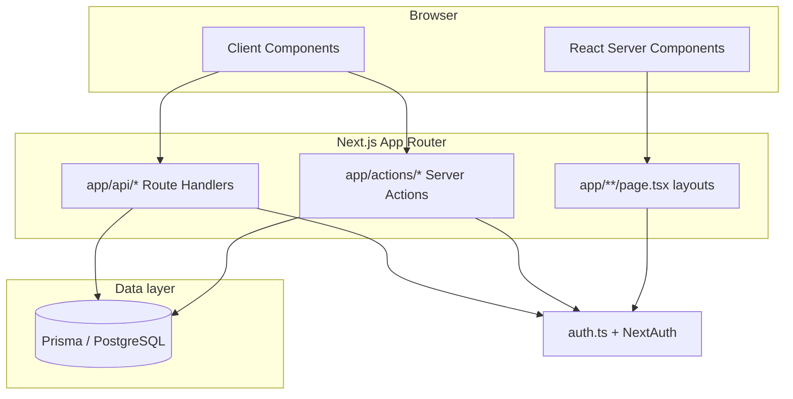

# Architecture

LingoCon is a **Next.js 14 App Router** application backed by **PostgreSQL** via **Prisma**. Most user-facing mutations go through **Server Actions** (`"use server"`) rather than a separate REST API, though there are still **Route Handlers** under `app/api/` for auth, exports, uploads, and integrations.

## High-level diagram

## Authentication and authorization

- **`auth.ts`** configures Auth.js (NextAuth v5): OAuth (GitHub, Google), credentials, Prisma adapter, JWT session strategy, and callbacks that copy `user.id` onto the JWT and session.
- **`DEV_MODE=true`** short-circuits real sign-in: `auth()` returns a synthetic session backed by a `dev@localhost` user (see `lib/dev-auth.ts`). This is for local development only.
- **`lib/auth-helpers.ts`** is the **application-level** gate used by Server Actions and pages:
  - `getUserId()` — current user or `null` (respects suspension).
  - `requireAuth()` — throws if unauthenticated.
  - `canEditLanguage` / `canViewLanguage` / `isLanguageOwner` — collaboration and visibility checks.

Always prefer these helpers over duplicating permission queries in random modules.

### Authorization rules that are easy to get wrong

- **Every export of a `"use server"` file is a public endpoint** — Next registers all of them,
  imported or not. Keep internal helpers (badge progress, audit logging, activity writes) in plain
  server modules (`lib/…`), never in `app/actions/*`.
- **Authorize against the stored row, not the client's claim.** An action that receives
  `{ id, languageId }` must check that the row actually belongs to `languageId` before writing
  (see `lib/services/dictionary-entry.ts`, `lib/services/language-scope.ts`), or scope the write
  with `updateMany/deleteMany({ where: { id, languageId } })`.
- **Scopes, not roles.** Collaborators are role `EDITOR` for *any* permission set (including
  drafts-only), so check `canEditScope(languageId, userId, "write:dictionary")` etc.
- **Reads:** `canReadLanguage` for data-returning actions (PUBLIC/UNLISTED readable by anyone,
  PRIVATE for owner/collaborators/admins); `canViewLanguage` gates the studio.
- **Pick fields explicitly.** Never spread action input into `prisma.*.update` — TypeScript types
  don't exist at runtime; parse an allow-list with Zod.
- **Errors:** return `toActionError(error, "fallback")` (`lib/errors.ts`) — it keeps user-facing
  validation/domain messages and hides everything else (Prisma messages name tables and columns).
- **User-supplied regexes** run through `lib/regex-sandbox.ts` (worker thread + deadline), never
  on the request thread.

## Routing and product surfaces

- **`/lang/[slug]/...`** — public or visibility-gated **reader** experience for a language (dictionary, grammar, texts, etc.).
- **`/studio/lang/[slug]/...`** — **authoring** UI for owners and editors.
- **`/dashboard`**, **`/admin`**, **`/settings`** — user dashboard, platform admin, and account settings.

Layouts under `app/lang/` and `app/studio/lang/` wrap children with navigation and context appropriate to each mode.

## Rich text and structured content

- **Grammar pages, articles, and similar** store TipTap (or compatible) JSON in Prisma `Json` fields.
- Custom TipTap extensions live under **`lib/tiptap/`** (for example paradigm and IGT blocks).

## Caching and revalidation

Server Actions call **`revalidatePath`** (and occasionally tag-based revalidation where implemented) after writes so public pages stay fresh. When you add a new mutation, follow existing actions: update the DB, then revalidate the studio **and** public paths that surface the same data.

## Performance conventions

- **Paginate lexicon views on the server.** Dictionaries can hold tens of thousands of entries;
  pass search/filter/page through the URL and query one page (`lib/services/dictionary-query.ts`).
  Never send a whole lexicon to the client — use a server action for "search the whole language"
  pickers (`searchLanguageEntries`) and server-computed trees (`lib/services/etymology.ts`).
- **Counts for one language:** use `getLanguageCounts` (`lib/services/language-counts.ts`).
  Prisma's relation `_count` on a single row aggregates the entire table before joining.
- **Per-request memoization:** `getUserId`/`isAdmin` are wrapped in `requestCache`
  (`lib/request-cache.ts`), a no-op outside Next's server runtime (worker, tests).
- **Rich text on public pages** renders from stored TipTap JSON on the server
  (`components/rich-text/tiptap-document.tsx`); only the studio loads the editor.
- `PRISMA_LOG_QUERIES=1` logs every query when you need to count round trips.

## Background and edge behavior

- **Job worker:** `scripts/worker.ts` (PM2 app `lingocon-worker`) polls the DB-backed queue in
  `lib/jobs/` — inflection regeneration, league rollover, heartbeats. Modules it imports must not
  use Next-only APIs (`server-only`, React `cache`).

- The root layout registers a **service worker** in production only; in development it unregisters workers to avoid stale HMR caches.
- Optional **AWS Polly** powers IPA pronunciation from `app/api/pronounce` when credentials are present.

## Design principles for changes

1. **Colocate** UI with the route that owns it when the component is not reused elsewhere.
2. **Put cross-cutting logic** in `lib/` (pure helpers) or `app/actions/` (mutations with auth and Prisma).
3. **Validate inputs** with Zod schemas in `lib/validations/` before trusting client-submitted data.
4. **Return structured errors** from Server Actions (`{ error: string }` or `ActionResult` from `lib/types/action-result.ts`) so the UI can toast or inline-validate consistently.
