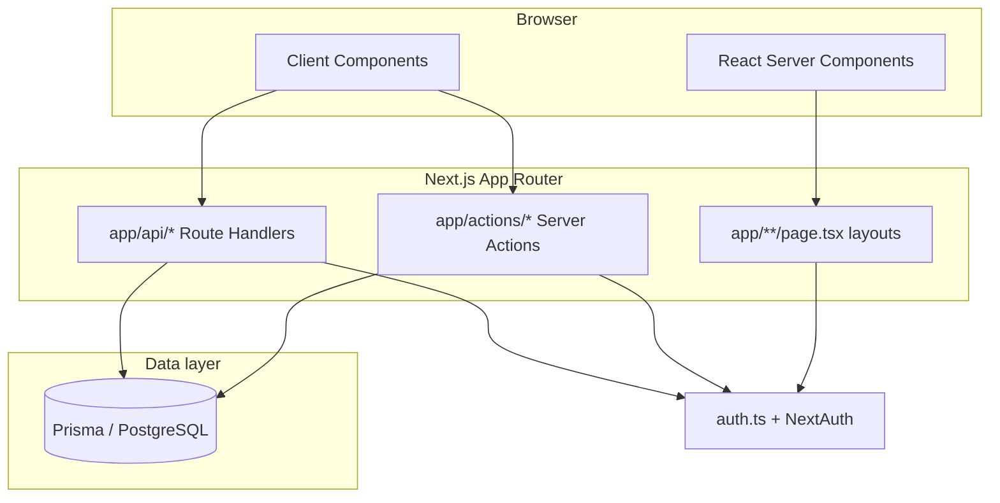

# Architecture

LingoCon is a **Next.js 14 App Router** application backed by **PostgreSQL** via **Prisma**. Most user-facing mutations go through **Server Actions** (`"use server"`) rather than a separate REST API, though there are still **Route Handlers** under `app/api/` for auth, exports, uploads, and integrations.

## High-level diagram

## Authentication and authorization

- **`auth.ts`** configures Auth.js (NextAuth v5): OAuth (GitHub, Google), credentials, Prisma adapter, JWT session strategy, and callbacks that copy `user.id` onto the JWT and session.
- **`DEV_MODE=true`** short-circuits real sign-in: `auth()` returns a synthetic session backed by a `dev@localhost` user (see `lib/dev-auth.ts`). This is for local development only.
- **`lib/auth-helpers.ts`** is the **application-level** gate used by Server Actions and pages:
  - `getUserId()` — current user or `null` (respects suspension).
  - `requireAuth()` — throws if unauthenticated.
  - `canEditLanguage` / `canViewLanguage` / `isLanguageOwner` — collaboration and visibility checks.

Always prefer these helpers over duplicating permission queries in random modules.

## Routing and product surfaces

- **`/lang/[slug]/...`** — public or visibility-gated **reader** experience for a language (dictionary, grammar, texts, etc.).
- **`/studio/lang/[slug]/...`** — **authoring** UI for owners and editors.
- **`/dashboard`**, **`/admin`**, **`/settings`** — user dashboard, platform admin, and account settings.

Layouts under `app/lang/` and `app/studio/lang/` wrap children with navigation and context appropriate to each mode.

## Rich text and structured content

- **Grammar pages, articles, and similar** store TipTap (or compatible) JSON in Prisma `Json` fields.
- Custom TipTap extensions live under **`lib/tiptap/`** (for example paradigm and IGT blocks).

## Caching and revalidation

Server Actions call **`revalidatePath`** (and occasionally tag-based revalidation where implemented) after writes so public pages stay fresh. When you add a new mutation, follow existing actions: update the DB, then revalidate the studio **and** public paths that surface the same data.

## Background and edge behavior

- The root layout registers a **service worker** in production only; in development it unregisters workers to avoid stale HMR caches.
- Optional **AWS Polly** powers IPA pronunciation from `app/api/pronounce` when credentials are present.

## Design principles for changes

1. **Colocate** UI with the route that owns it when the component is not reused elsewhere.
2. **Put cross-cutting logic** in `lib/` (pure helpers) or `app/actions/` (mutations with auth and Prisma).
3. **Validate inputs** with Zod schemas in `lib/validations/` before trusting client-submitted data.
4. **Return structured errors** from Server Actions (`{ error: string }` or `ActionResult` from `lib/types/action-result.ts`) so the UI can toast or inline-validate consistently.
